# AI Interview Bot Interaction Flow

This document details the complete, end-to-end multimodal interaction loop between the Candidate, the React Frontend, the Node.js Streaming Bridge, and the Gemini 2.0 Multimodal Live API.

## Complete End-to-End Flow (As Implemented)

```mermaid
sequenceDiagram
    autonumber
    
    actor User as Candidate
    participant UI as React Frontend (InterviewRoom)
    participant WS as Node.js WebSocket Bridge
    participant Gemini as Vertex AI Gemini Live API

    %% 1. INITIALIZATION
    rect rgb(20, 30, 50)
        Note right of User: Phase 6: Session Configuration & Setup
        User->>UI: Selects "System Design" & "TypeScript"
        UI->>WS: POST /api/sessions/new (Creates Session)
        WS-->>UI: sessionId
        UI->>WS: ws:// connect(sessionId)
        WS->>Gemini: wss:// connect()
        Note over WS, Gemini: System Prompt dynamically generated via PromptFactory
        WS->>Gemini: sendSetupMessage(system_instruction)
    end

    %% 2. MULTIMODAL INPUT (STREAMING UP)
    rect rgb(20, 50, 30)
        Note right of User: Phase 3: Multimodal Input (Audio & Video)
        
        par Audio Stream (Continuous)
            User->>UI: Speaks ("I think I will use a Hash Map...")
            Note over UI: AudioRecorderService captures raw Float32
            Note over UI: pcm-processor (AudioWorklet) converts to Int16
            UI->>WS: { type: 'audio_segment', payload: base64(PCM16) }
            WS->>Gemini: RealtimeInput (mimeType: 'audio/pcm')
        and Video Stream (1 FPS)
            User->>UI: Types code in Monaco Editor
            Note over UI: ScreenShareService captures <video> frame
            UI->>WS: { type: 'screen_frame', payload: base64(JPEG) }
            WS->>Gemini: RealtimeInput (mimeType: 'image/jpeg')
        and Context Stream (Debounced)
            User->>UI: Code changes
            UI->>WS: { type: 'code_update', payload: code }
            WS->>Gemini: ClientContent (Text)
        end
    end

    %% 3. MULTIMODAL OUTPUT (STREAMING DOWN)
    rect rgb(50, 20, 50)
        Note right of User: Phase 4 & 5: Multimodal Output & Agentic UI
        
        Gemini-->>WS: ServerContent (modelTurn)
        
        par Text Feedback
            Note over WS: Extracts text parts
            WS-->>UI: { type: 'model_text', payload: { text: "Good idea!" } }
            UI->>UI: useInterviewStore.addFeedback()
            UI->>User: Renders Coach Feedback Card
        and Audio Voice
            Note over WS: Extracts inlineData (audio/pcm)
            WS-->>UI: { type: 'model_audio', payload: { audioData } }
            UI->>UI: audioPlaybackQueue.enqueue(audioData)
            UI->>UI: AiVisualizer ("Alex is speaking...")
            UI->>User: Web Audio API plays voice
        and Tool Calls (Agentic UI)
            Note over WS: Extracts functionCall
            WS-->>UI: { type: 'model_tool_call', payload: { tool: 'setup_coding_task' } }
            UI->>UI: useInterviewStore.handleToolCall()
            UI->>User: Monaco Editor updates with starter code
            UI->>WS: { type: 'tool_response', payload: { success: true } }
            WS->>Gemini: ClientContent (ToolResponse)
        end
    end

    %% 4. INTERRUPTION HANDLING
    rect rgb(50, 20, 20)
        Note right of User: Phase 12 & 13: Interruption & Parity
        User->>UI: Interrupts AI ("Actually, wait...")
        UI->>WS: audio_segment (User voice detected)
        WS->>Gemini: RealtimeInput (Voice)
        Gemini-->>WS: ServerContent { interrupted: true }
        WS-->>UI: { type: 'model_interruption' }
        UI->>UI: audioPlaybackQueue.stop()
        Note over UI, User: AI voice instantly stops playing
    end
```

## Core Architectural Pillars Implemented

### 1. Ultra-Low Latency Media Pipeline
Instead of the legacy HTTP polling architecture, the system now relies exclusively on persistent WebSockets. 
*   **Audio Capture**: Utilizes a custom Web Audio API `AudioWorklet` (`pcm-processor.js`) running in a separate thread to capture raw microphone input, downsample it, and convert it to bounded `Int16Array` chunks. These are base64 encoded and streamed directly into Gemini's `RealtimeInput`.
*   **Video Capture**: Leverages `navigator.mediaDevices.getDisplayMedia`. A 1 FPS interval extracts Base64 JPEG frames from a hidden `<video>` element, allowing the AI to physically "see" the candidate's screen.

### 2. Deterministic Audio Scheduling & Interruption
*   **Playback Queue**: The `AudioPlaybackQueue` singleton converts inbound 24kHz Base64 PCM16 chunks from the backend back into `AudioBuffer` objects.
*   **Interruption Handling**: Because human conversations overlap, if the candidate speaks while the AI is talking, Gemini detects the voice activity and sends an `interrupted: true` signal. The backend relays this to the frontend, which immediately calls `audioPlaybackQueue.stop()`, instantly halting the `AudioBufferSourceNode` and clearing the queue.

### 3. Agentic UI & Tool Calling
The system utilizes a "State-Driven UI" architectural principle. 
*   **The Store**: `useInterviewStore` (Zustand) is the single source of truth.
*   **Tool Execution**: When the AI decides the candidate needs a specific coding challenge, it invokes a tool call. The backend normalizes this into a `model_tool_call` websocket message. The frontend intercepts this, updates the Zustand store (`code`, `language`, `currentChallenge`), and the Monaco editor instantly re-renders. 
*   **Tool Acknowledgment**: Crucially, the frontend replies with a `tool_response` back through the WebSocket. If this step is missed, the Gemini Live API will hang indefinitely waiting for the function result.

### 4. Dynamic Persona Generation
The system does not use a single static prompt.
*   **Session Configuration**: Before the room opens, the candidate selects their parameters (e.g., "System Design" + "Java"). 
*   **Prompt Factory**: The Node.js backend uses `PromptFactory.generate(config)` to build a highly specific System Instruction.
*   **Injection**: This dynamic prompt is injected directly into the Gemini Live API `sessionConfig` during the initial connection handshake.

---

**Date Updated:** 2026-03-28  
**Status:** ✅ Fully Implemented (Phases 1-6, 11-12)  
**Impact:** Core architectural migration complete. The platform now supports sub-second, bi-directional multimodal conversations with visual screen context and tool-driven UI updates.
